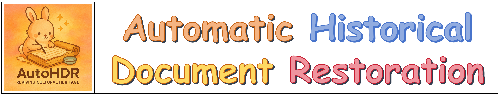
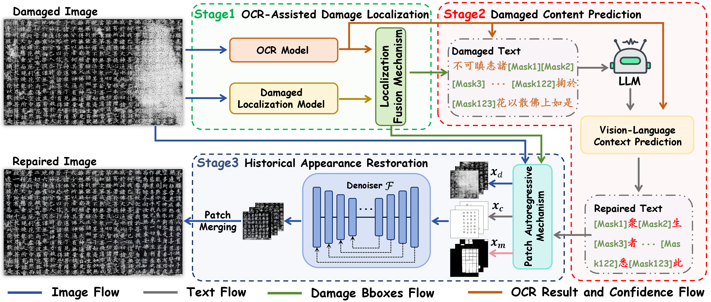
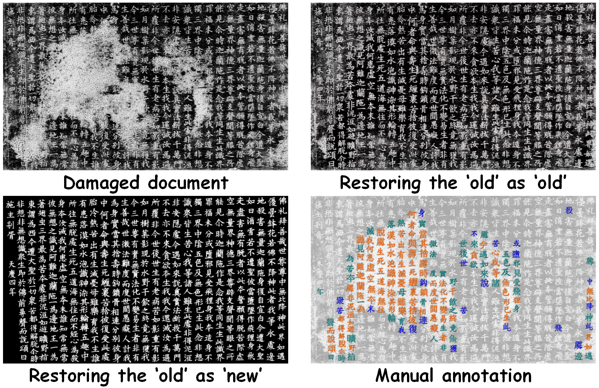
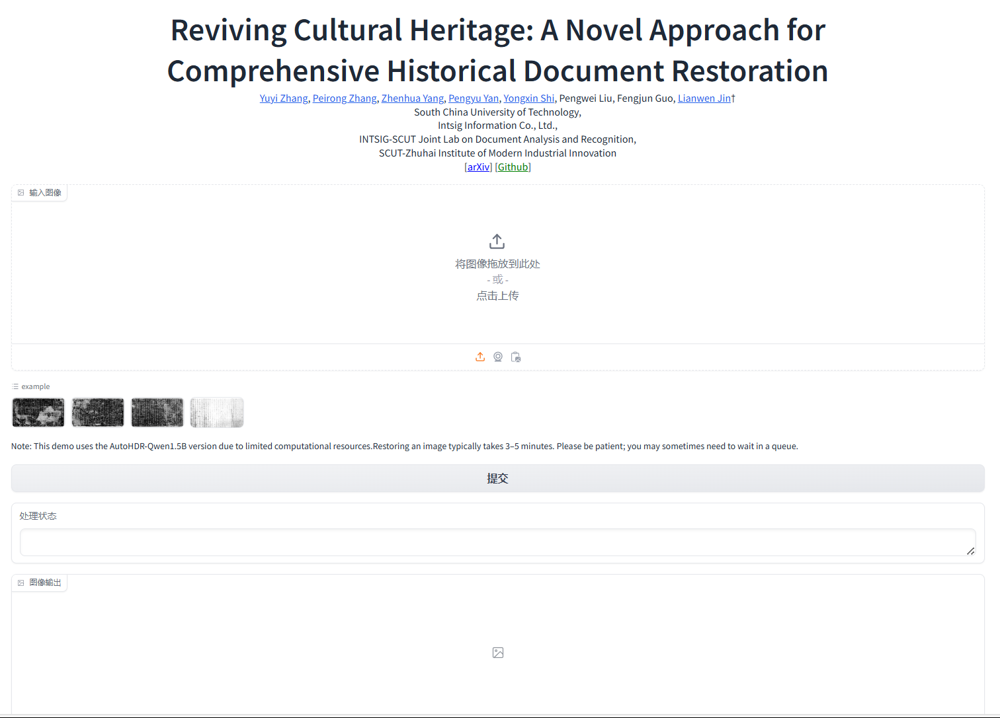
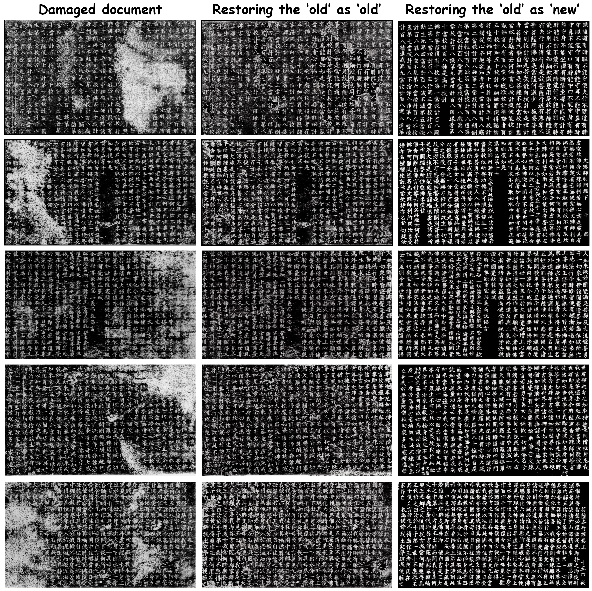

<div align=center>

# Reviving Cultural Heritage: A Novel Approach for Comprehensive Historical Document Restoration

</div>

 

<div align=center>

[](https://arxiv.org/abs/2507.05108) 
[](http://121.41.49.212:8432/)
[](https://github.com/ZZXF11)
[](http://dlvc-lab.net/lianwen/)
[](https://github.com/SCUT-DLVCLab/AutoHDR)
<!-- []([https://](https://github.com/SCUT-DLVCLab/AutoHDR)) -->

</div>

## Important Note
The original data of the dataset is sourced from public channels such as the Internet, and its copyright shall remain with the original providers. The collated and annotated dataset presented in this case is for non-commercial use only and is currently licensed to universities and research institutions. To apply for the use of this dataset, please fill in the corresponding application form in accordance with the requirements specified on the dataset’s official website. The applicant must be a full-time employee of a university or research institute and is required to sign the application form. For the convenience of review, it is recommended to affix an official seal (a seal of a secondary-level department is acceptable).

## 🌟 Highlights
- AutoHDR

- FPHDR dataset

- We propose a novel fully Automated solution for HDR **(AutoHDR)**, inspired by mirroring the workflow of expert historians.
- We introduce a pioneer Full-Page HDR dataset **(FPHDR)**, which supports comprehensive HDR model training and evaluation. 
- Extensive experiments demonstrate the superior performance of our method on both text and appearance restoration.
- The modular design enables flexible adjustments, allowing AutoHDR to collaborate effectively with historians.

## 📅 News
- **2026.07.15**: 🎉 We propose [UniHIR](https://aclanthology.org/2026.acl-long.1254/), a Unified MLLM for end-to-end Historical Inscription Restoration.
- **2025.07.21**: 📢 Released the FPHDR dataset!
- **2025.07.17**: 🚀 The pretrained [model](#-model-zoo) has been released!
- **2025.07.13**: 🔥🎉 The 💻 [demo](http://121.41.49.212:8432/) is now live! Welcome to try it out!
- **2025.07.09**: Release the inference code.
- **2025.07.08**: Our [paper](https://arxiv.org/abs/2507.05108) is now available on arXiv.
- **2025.05.15**: 🎉🎉 Our [paper](https://arxiv.org/abs/2507.05108) is accepted by ACL2025 main.

## 🚧 TODO List

- [x] Release inference code
- [x] Release pretrained model
- [x] Release a [WebUI](http://121.41.49.212:8632/)
- [x] Release dataset
- [ ] Upload pretrained model to Hugging Face


## 🔥 Model Zoo
| **Model**                                    | **Checkpoint** | **Status** |
|----------------------------------------------|----------------|------------|
| **AutoHDR-Qwen2-1.5B**                   | [BaiduYun:W2wq](https://pan.baidu.com/s/1j_HmyNDG0dOD6TyBHvqYwQ?pwd=W2wq) | Released  |
| **AutoHDR-Qwen2-7B**                     | [BaiduYun:6o84](https://pan.baidu.com/s/1CUREGQIBoed1BgHjELguTQ?pwd=6o84) | Released  |
| **DiffHDR**         | [BaiduYun:63a3](https://pan.baidu.com/s/1fSKd5uQsiKp2uPQBdKtC3Q?pwd=63a3) | Released  |
| **Damage Localization Model**            | [BaiduYun:2QC7](https://pan.baidu.com/s/1wGcT6Ktzqg_bOyc8NsV4Ig?pwd=2QC7) | Released  |
| **OCR Model**       | [BaiduYun:1X88](https://pan.baidu.com/s/1GfNQKIJ17Yf6QSv-dCaPEQ?pwd=1X88) | Released  |


## 🔥 FPHDR Dataset
| **Dataset**             | **Link** | **status** |
|----------|----------|-------------|
| Real data | [BaiduYun:ryk3](https://pan.baidu.com/s/1zpS4B3E0eZJ9Hza-HxpX4w?pwd=ryk3) | Released |
| Synthetic data | [BaiduYun:m8yn](https://pan.baidu.com/s/1Lrd51vChv72f2WZSNx8R2w?pwd=m8yn ) | Released |

**Note:**
- The FPHDR dataset can only be used for non-commercial research purposes. For scholar or organization who wants to use the FPHDR dataset, you can apply through either of the following two options:

  **Option A: Apply Online**
  Submit your application through our online platform: 👉 [Apply Here](http://121.41.49.212:9000/)

  **Option B: Apply via Email**
  Please first fill in this [Application Form](./application-form/Application-Form-for-Using-FPHDR.docx) and sign the [Legal Commitment](./application-form/Legal-Commitment.docx) and email them to us ([eelwjin@scut.edu.cn](mailto:eelwjin@scut.edu.cn), cc: [yuyi.zhang11@foxmail.com](mailto:yuyi.zhang11@foxmail.com)). When submitting the application form to us, please list or attached 1-2 of your publications in the recent 6 years to indicate that you (or your team) do research in the related research fields of OCR, historical document analysis and restoration, document image processing, and so on.

- We will give you the decompression password after your application has been received and approved.
- All users must follow all use conditions; otherwise, the authorization will be revoked.

<details>
<summary><b>Dataset File Structure</b></summary>

```plaintext
images/
  ├── FS_2_2_1.jpg
  ├── FS_2_9_1.jpg
  ├── ...
labels/
  ├── FS_2_2_1.json
  ├── FS_2_9_1.json
  ├── ...
```
</details>

<details>
<summary><b>Label Annotation Format</b></summary>

```plaintext
{
  "columns": [
    {
      "x": ...,
      "y": ...,
      "w": ...,
      "h": ...,
      "column_id": "...",
      "idx": ...
    },
    ...
  ],
  "chars": [
    {
      "x": ...,
      "y": ...,
      "w": ...,
      "h": ...,
      "txt": "...",
      "cid": ...,
      "char_id": "...",
      "idx": ...,
      "grade": "light|medium|severe|null"
    },
    ...
  ]
}
```

- columns: Column bounding boxes (x, y, w, h)
- chars: Character annotations (txt, x, y, w, h, grade)
- grade: Damage level (light, medium, severe, or empty for no damage)

</details>

## 🚧 Installation
### Prerequisites
- **Ubuntu 20.04** (required)
- Linux
- Python 3.10
- Pytorch 2.3.0
- CUDA 11.8

### Environment Setup
Clone this repo:
```bash
git clone https://github.com/SCUT-DLVCLab/AutoHDR.git
```

**Step 0**: Download and install Miniconda from the [official website](https://docs.conda.io/en/latest/miniconda.html).

**Step 1**: Create a conda environment and activate it.
```bash
conda create -n autohdr python=3.10 -y
conda activate autohdr
```

**Step 2**: Install the required packages.
```bash
pip install -r requirements.txt
```

## 📺 Inference

**Step 0**: Download all model files (except the OCR model) from the [Model Zoo](#-model-zoo) and put them in the `ckpt` folder.

**Step 1**: Download the OCR model files from the [Model Zoo](#-model-zoo), unzip the package, and move the extracted files into the `dist` folder.

**Step 2**: Using AutoHDR for damaged historical documents Restoration:
```bash
CUDA_VISIBLE_DEVICES=<gpu_id> python infer_pipeline.py
```

## 🚀 RUN WebUI
We provide two convenient ways to run the WebUI demo:

**(1)** Visit our deployed online demo directly:
[demo](http://121.41.49.212:8432/)

**(2)** Run the demo locally:
```bash
CUDA_VISIBLE_DEVICES=<gpu_id> python demo_gradio.py
```

example:



## ☎️ Contact
If you have any questions, feel free to contact [Yuyi Zhang](https://github.com/ZZXF11) at [yuyi.zhang11@foxmail.com](yuyi.zhang11@foxmail.com)

## 🌄 Gallery


## 💙 Acknowledgement
- [mmdetection](https://github.com/open-mmlab/mmdetection)
- [Qwen](https://github.com/QwenLM/Qwen3)
- [DiffHDR](https://github.com/yeungchenwa/HDR)
- [diffusers](https://github.com/huggingface/diffusers)
- [HisDoc1B](https://github.com/SCUT-DLVCLab/HisDoc1B)
- [MegaHan97K](https://github.com/SCUT-DLVCLab/MegaHan97K)

## 📜 License
The code and dataset should be used and distributed under [ (CC BY-NC-ND 4.0)](https://creativecommons.org/licenses/by-nc-nd/4.0/) for non-commercial research purposes.

## ⛔️ Copyright
- This repository can only be used for non-commercial research purposes.
- For commercial use, please contact Prof. Lianwen Jin (eelwjin@scut.edu.cn).
- Copyright 2025, [Deep Learning and Vision Computing Lab (DLVC-Lab)](http://www.dlvc-lab.net), South China University of Technology. 

## ✒️Citation
If you find AutoHDR helpful, please consider giving this repo a ⭐ and citing:
```latex
@article{Zhang2025autohdr,
      title={Reviving Cultural Heritage: A Novel Approach for Comprehensive Historical Document Restoration}, 
      author={Yuyi Zhang and Peirong Zhang and Zhenhua Yang and Pengyu Yan and Yongxin Shi and Pengwei Liu and Fengjun Guo and Lianwen Jin},
      journal={Proceedings of the 63rd Annual Meeting of the Association for Computational Linguistics},
      year={2025},
}
```
Thanks for your support!
